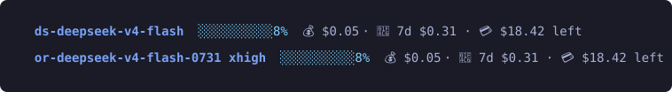

<h1 align="center">cc-ds4</h1>

<p align="center">
  <strong>Run DeepSeek V4 in Claude Code without breaking your Anthropic setup.</strong><br>
  Isolated profiles, zero-data-retention routing, and a status line that reports what you actually spent.
</p>

<p align="center">
  <a href="https://github.com/STRML/cc-ds4/actions/workflows/tests.yml"></a>
  <a href="LICENSE"></a>
  
  
</p>

<p align="center">
  
</p>

---

Claude Code talks to Anthropic over a documented HTTP API, and it will talk to
anything that speaks the same shape. Several providers now serve an
Anthropic-compatible `/v1/messages` endpoint, so you can point Claude Code at a
different model without patching the client.

The catch is that Claude Code reads its configuration from one directory, and the
obvious way to redirect it (exporting `ANTHROPIC_BASE_URL`, or editing
`~/.claude/settings.json`) redirects **every** session on the machine, including ones
already running. That is the failure mode this whole setup exists to avoid.

The fix is per-profile config directories. Each profile is its own
`~/.claude-<label>` with its own `settings.json` carrying the provider's base URL,
key, and model names. `CLAUDE_CONFIG_DIR` selects one at launch. Your normal `claude`
keeps hitting Anthropic. Nothing global is touched.

## Safe local proxy contract

The proxy is a local security boundary, not an unauthenticated convenience port. Installed profile listeners authenticate every POST with that profile's `ANTHROPIC_AUTH_TOKEN`; comparison is constant-time and a missing or wrong credential is rejected before any upstream request. The proxy never substitutes another profile's key unless its own authenticated request has already entered the explicit failover path.

For each request that must not leave a zero-data-retention route, send the proxy-local `ds4_require_zdr: true` field (or the equivalent `X-DS4-Require-ZDR: 1` header). The proxy rejects it with HTTP 409 unless the selected profile supports ZDR and `DS4_ZDR` is enabled; the marker is removed before forwarding. This is fail-closed: a direct or Nous request cannot claim ZDR merely by setting the flag.

On macOS, `install.sh` enables `DS4_REQUIRE_OWNED_SOCKET=1` in the launch agent. launchd binds each loopback port and passes the already-listening descriptor to the proxy (`launch_activate_socket`); the proxy refuses to self-bind when no OS-owned descriptor is present. This closes the preflight/connect TOCTOU race. Run the proxy manually only for development, with the default compatibility mode; do not use that mode for private work. Other platforms must provide an equivalent OS-owned socket-activation mechanism before enabling the flag; with the flag enabled, no socket means no service.

The supported call pattern is one isolated environment per route. Do not merely export `ANTHROPIC_BASE_URL` from a normal Anthropic shell: that can send the normal Anthropic credential to a third-party route. Instead clear inherited credentials and select the matching profile:

```sh
env -u ANTHROPIC_BASE_URL -u ANTHROPIC_API_KEY -u ANTHROPIC_AUTH_TOKEN \
    CLAUDE_CONFIG_DIR="$HOME/.claude-or-ds4" \
    claude --print 'prompt'
```

Claude then loads the route's own `settings.json`, including its local proxy URL and client credential. Prefer the profile launcher installed by the setup prompt, which constructs this environment without inheriting any `ANTHROPIC_*` values. Repeat the pattern with `.claude-ds4`/`:31500` or `.claude-nous`/`:31502` as appropriate.

## Quick start

Paste a setup prompt into a Claude Code session and it does the work, asking before
anything irreversible:

| Profile | Provider | Model | Pins a dated build? | Extra process | Setup |
|---|---|---|---|---|---|
| `claude-ds4` | DeepSeek direct | `deepseek-v4-flash` / `-pro` | no | proxy on :31500 | [prompt](profiles/deepseek-direct.md) |
| `claude-or-ds4` | OpenRouter | `deepseek-v4-flash-0731` | **yes** | proxy on :31501 | [prompt](profiles/openrouter.md) |
| `claude-nous` | Nous Portal | `deepseek-v4-flash-0731` | **yes** | proxy on :31502 | [prompt](profiles/nous.md) |
| `claude-kimi` | Moonshot | `kimi-k3` / `k3` | n/a | none | [prompt](profiles/kimi.md) |

Already have a profile and want the proxy and the corrected status line brought up
to date:

```sh
git clone https://github.com/STRML/cc-ds4 && cd cc-ds4
./install.sh --profile openrouter        # or --profile direct / --profile nous
```

> [!WARNING]
> **Claude Code's cost figure is wrong on these profiles, and plausibly wrong.**
> It prices whatever model name you give it against Anthropic's table. One measured
> session reported **$0.152731** against **$0.002637** actual. The multiplier scales
> with the output-token share, so you cannot divide it out. That is what the status
> line in this repo exists to fix.

## Which one: this is a privacy decision, not a performance one

The two DeepSeek profiles reach similar models at very different privacy costs, and
that should drive the choice.

**`claude-ds4` (DeepSeek direct) is faster and cheaper.** It measured 1.32s median time
to first token on a 33k prompt at roughly 50 tok/s, beating every OpenRouter provider
tested. Its prompt caching is implicit and automatic, which matters more than raw
speed for agent work: an identical 32,653-token prompt billed 32,653 tokens on the
first call and **13** on every call after.

You pay for that by sending your prompts to DeepSeek, under terms that permit
retention and training, on infrastructure in the PRC. For a scratch repo that may be
fine. For work code, customer data, or anything under an NDA, it is not.

**`claude-or-ds4` (OpenRouter) is slower and costs more, and is the safer default.**
OpenRouter sits between you and the inference provider, and it supports
**zero-data-retention routing**: set `zdr: true` and requests will only go to
endpoints contractually bound not to retain them. The setup here turns that on by
default.

The cost is real and worth stating plainly. You lose implicit caching, which is the
larger expense for agent workloads, because the only endpoint for this model that
supports it is DeepSeek's own and ZDR excludes it. Provider routing varies in speed
and price from request to request.

Both profiles run a local proxy that has to be up, so that is no longer a reason to
prefer one. See [thinking mode](#thinking-mode-is-on-by-default-and-it-eats-the-small-calls)
for why the direct profile grew one.

**Use `claude-or-ds4` when a pinned build matters,** too. DeepSeek's own API accepts
exactly two model names and has no dated variants, so `deepseek-v4-flash` floats to
whatever they ship. OpenRouter serves `deepseek/deepseek-v4-flash-0731` explicitly at
1,048,576 context.

**`claude-kimi` is independent** of the other two and predates them. Same profile
structure, different provider.

## Zero data retention on OpenRouter

Two ways to turn it on, and you want the second.

Account-wide at [openrouter.ai/settings/privacy](https://openrouter.ai/settings/privacy)
applies to everything on the key, including other tools. Per-request is scoped to this
profile and cannot be silently changed from a web dashboard, so the `claude-or-ds4`
proxy injects it into every request body:

```json
"provider": {"zdr": true, "data_collection": "deny"}
```

Facts worth knowing before you rely on it:

- **`/api/v1/models/{id}/endpoints` does not expose any ZDR field.** The API tells you
  price, quantization, throughput, latency, and uptime per endpoint, but nothing about
  retention. The only way to learn the ZDR pool is to send `zdr: true` and read back
  which provider answered.
- **ZDR is not as restrictive as it sounds.** 7 of 11 endpoints survive the filter
  for `deepseek-v4-flash-0731`:

  | | endpoints |
  |---|---|
  | ✅ ZDR-eligible | DeepInfra, Fireworks, Novita, Parasail, SiliconFlow, Io Net, Mancer 2 |
  | ❌ filtered out | GMICloud, Cloudflare, AtlasCloud |
- **It does not cost you quantization quality.** DeepInfra answers most requests
  because it is cheapest, and it is the one fp4 endpoint in the pool, but the other six
  ZDR providers are fp8 and routing reaches them regularly.
- **It can cost you context, and this one bites.** Endpoints for the same model do not
  all serve the same window. Io Net is ZDR-eligible but caps at 262,100 tokens against
  1,048,576 everywhere else, so a long session that happens to route there overflows
  the endpoint rather than the window you configured. The proxy adds
  `ignore: ["Io Net"]` for exactly this reason. Recheck `context_length` per endpoint
  when the provider list changes.
- **Verify by pinning, not by observing.** Provider selection fluctuates enough that
  a handful of samples will mislead you badly. To test whether a specific provider is
  ZDR-eligible, send `provider: {"only": ["Novita"], "zdr": true}` and see whether it
  answers or returns "No endpoints found matching your data policy".

## The `claude-nous` variant: Nous Portal

[`claude-nous`](profiles/nous.md) is a third way to reach the same pinned
`deepseek-v4-flash-0731` model, billed through [Nous Portal](https://portal.nousresearch.com)
rather than OpenRouter or DeepSeek directly. Same per-profile isolation, same
per-tier effort proxy — the differences are the point:

- **It can be far cheaper.** Nous exposes the discounted per-token rate in its
  `/v1/models` pricing (at the time of writing, 90% off the `-0731` list price).
  The status line prices sessions at that rate, live. The discount is a promotion,
  not a guarantee — for that reason treat `claude-nous` as opportunistic, and
  re-check the fallback rates in `src/statusline/nous.py` if the pricing changes.
- **No zero-data-retention control.** Nous 403s OpenRouter's
  `provider: {zdr: true}` block (empty body — the portal rejects the unknown
  `provider` field), so this profile never sends one (`DS4_ZDR=0` is its effective
  state, and the switch only ever turns the block off, never on where it 403s).
  Privacy-wise this is a **direct-style** profile, not an OpenRouter-style one:
  requests are governed by Nous's own, undisclosed retention policy. Do not reach
  for it with NDA data.
- **A subscription, optionally topped up.** It exposes **no public credits or
  balance endpoint**, so the status line shows only the session cost — no `📆 7d`
  or `💳 left` segments. The balance lives in the portal dashboard.
- **Cloudflare.** Nous sits behind Cloudflare, which 403s the stdlib's default
  `urllib` User-Agent (`error code: 1010`). The proxy now sends a `curl`-style UA
  (`DS4_UA`) on every outbound request — required for Nous, harmless for the other
  profiles it forwards.
- **Pinned build.** Like OpenRouter, Nous serves the dated `deepseek-v4-flash-0731`
  at 1,048,576 context, so the build does not float. It also lists a
  `~deepseek/...-latest` alias, which the setup deliberately avoids.

Like the OpenRouter profile it needs the effort proxy running (on `:31502`); the
launcher starts it on demand.

## DeepSeek V4 is text-only — images are transcribed, not seen

DeepSeek V4 cannot see images. Verified by sending a real PNG, not by reading
capability metadata: an image with the words "PURPLE 7391 / ZEBRA MARMALADE"
plus a prompt asking for a transcription returned `NO IMAGE` on both DeepSeek
direct models, and a `404 No endpoints found that support image input` on
OpenRouter. No `deepseek*` model on any provider accepts image input.

The proxy turns that into something usable. When a request carries an image
block, the proxy hands it to a local `claude -p --model haiku` child on your
Anthropic profile (subscription credits, no new credential), gets a text
description, and forwards the description to DeepSeek instead of the pixels.
Descriptions are cached by content hash, so a repeated image (or the same
screenshot in both a paste and a tool result) is described once.

**The description is a lossy proxy, not the image.** DeepSeek never receives the
pixels — it reasons over a text description, so charts, UI layouts, and
transcripts degrade. For pixel-faithful vision keep a vision-native profile
(Kimi K3, Anthropic) for those turns.

**It does not clear an already-poisoned transcript.** The rewrite happens per
request; a session that already failed on an image keeps the image in its own
history and will keep rewriting it. `/compact` or `/clear` clears a stuck
session. (Before this feature, an image in the transcript made every later turn
404 or silently drop — the image is what broke it.)

Two knobs and two facts:

- `DS4_VISION=0` restores the old pass-through: image blocks are forwarded
  unchanged. On OpenRouter/Nous that fails loudly (404); on DeepSeek direct the
  image is dropped silently and the model answers confidently from nothing.
- The image leaves the machine: it is sent to Anthropic through your `~/.claude`
  profile for transcription. `vision-cache/` under the profile dir holds the
  descriptions, keyed by content hash.
- The transcription is untrusted data: an image can contain instructions. Treat
  a description as evidence, not a directive.
- The proxy's loopback listener is not authenticated, and the child loads your
  real Anthropic profile — so any local process could in principle spend your
  Anthropic quota via the vision path. This matches the pre-existing trust
  model of the proxy.

## Thinking mode is on by default, and it eats the small calls

This is why both profiles run a proxy.

Claude Code sends `thinking: {"type":"adaptive","display":"omitted"}` on every request,
captured on the wire. DeepSeek does not implement `adaptive`, so V4 stays in its
default thinking mode. The main loop is fine at `max_tokens=32000`. The small utility
calls are not, and the permission classifier behind `defaultMode: auto` is one of them:
the thinking block consumes the whole budget and the request is cut off before the tool
call comes out.

Measured on the direct endpoint with a classifier-shaped forced decision, five runs per
row:

| `max_tokens` | thinking | result |
|---|---|---|
| 512 | adaptive | **3 of 5 truncated**, two of those with no `tool_use` block at all |
| 1024 | adaptive | 0 of 5, output 432-665 |
| 2048 | adaptive | 0 of 5, output 441-689 |
| 512 | disabled | 0 of 5, output 141-175, 2.0s instead of 5.2s |

Output ran 210 to 805 tokens across identical prompts, so it fails on some runs and not
others. That variance is the whole reason this reads as flaky rather than broken.

Two other rules of thinking mode bite the same calls:

- **`tool_choice` naming a specific tool is rejected outright**: `400 Thinking mode
  does not support this tool_choice`. `auto`, `none`, and omitted are accepted. This
  one is not intermittent, it fails every time in 0.4s.
- **On the direct endpoint only**, an assistant message carrying a `tool_use` must
  carry its `thinking` block too, or you get a 400 reading "The `content[].thinking`
  in the thinking mode must be passed back to the API". Claude Code 2.x replays it, so
  this is not a live failure, but a path that ever drops the block kills the session.
  OpenRouter does not enforce this rule.

**All three go away with `thinking: {"type":"disabled"}`.** Both endpoints honour the
Anthropic spelling. Neither honours its own native one: `reasoning_effort` on the
DeepSeek OpenAI-compatible endpoint and `reasoning: {"enabled": false}` on OpenRouter
are both dropped without error. Public reports conclude that no non-thinking mode is
reachable, which is true of the OpenAI-compatible endpoint and wrong of
`/v1/messages`.

The proxies apply this at or below `max_tokens=8192` (`DS4_NOTHINK_BELOW`), which
separates the utility calls from the main loop with a wide margin. Nothing observed
lands between the two.

## Routing the permission classifier

The auto-mode permission classifier (the small `ds4-high` call that gates every tool
call) is a security gate: it sees the intent of every tool call before anything else.
By default the gate lives in a trusted boundary; the other routes trade that boundary
for cost or simplicity. The classifier body is already an Anthropic-shaped request, so
forwarding it is a relay swap, not a rewrite.

`DS4_CLASSIFIER` picks the route. Set it before `install.sh`; to change an already
installed setup, export it and re-run `install.sh` (it rewrites the launchd agent and
restarts the proxy).

- **`anthropic`** (default) — forwarded to the Anthropic subscription. Auth is
  `DS4_CLASSIFIER_TOKEN`, a long-lived subscription token from `claude setup-token`.
  Without it the classifier fails open to the ds4 path. The gate stays in a trusted
  boundary, at the cost of burning subscription tokens on every tool call.
- **`zdr`** — forwarded to the **or-ds4 route** (OpenRouter, ZDR forced on): no
  subscription token spent, and ZDR keeps the classifier's view of tool-call intent
  off training. The gate now runs on DeepSeek V4 Flash via OpenRouter rather than
  Anthropic — a lower-trust boundary, so this is opt-in. Requires or-ds4 installed
  with a key; without it the classifier fails open to the Anthropic route, then ds4.
- **`ds4`** — the classifier rides the profile's own upstream, same as a normal
  request. No trusted boundary, no ZDR, nothing spent. The tradeoff is documented in
  the profiles; the safest non-Anthropic option is `zdr`, not this.

- **Model** defaults to `claude-sonnet-5` (`DS4_CLASSIFIER_MODEL` overrides). Sonnet
  matches the 1M context window the profiles advertise — the classifier transcript
  can be large in a long auto-mode session, and a 200K-window model (haiku) overflows
  it. Still the trusted Anthropic boundary. The or-ds4 route uses the or-ds4 profile's
  model (`DS4_ORDS4_CLASSIFIER_MODEL` overrides).
- Only the classifier moves. The main loop and subagents keep the DeepSeek routing.

## Things that cost real time to discover

<details>
<summary>Findings that each wasted an hour somewhere. Worth reading before you debug anything.</summary>

- **Base URL trailing path differs by provider.** Claude Code appends `/v1/messages`
  itself. OpenRouter wants `https://openrouter.ai/api` with no `/v1`; adding it
  yields `/v1/v1/messages` and 404s everything.
- **`ANTHROPIC_API_KEY` usually needs to be `""`, not absent.** A stale value there
  surfaces as a confusing model-not-found rather than a clean 401.
- **Effort control is not portable.** `CLAUDE_CODE_EFFORT_LEVEL` is a single global
  with no per-tier variant. OpenRouter takes `reasoning_effort` as a request
  parameter; DeepSeek ignores that spelling entirely and takes `output_config.effort`
  instead. Neither accepts effort inside a model ID for these models. Tiers are the
  only per-request knob Claude Code exposes, so the `claude-or-ds4` proxy reads a
  sentinel model name and rewrites it. That, plus the thinking-mode problem above, is
  what the proxies are for. Since `/effort` never reaches the request body, a
  `/ds4-effort` slash command (installed by `install.sh`) writes a per-profile
  override file that the proxy applies to the next request — the level can change
  mid-session without a restart.
- **Silence is not success.** DeepSeek drops unknown parameters without error, so a
  200 response proves nothing about whether your parameter did anything. Probe with a
  deliberately invalid value: if it errors, the field is real. OpenRouter's
  Anthropic-compatible endpoint does honour `provider` routing, which is not obvious
  and is worth confirming the same way.
- **On OpenRouter, one model id is many deployments.** Price, quantization, speed, and
  caching all vary per provider. `/api/v1/models` shows only the cheapest endpoint,
  which is why pricing looks flat when it is not. Output price varied 5.6x across
  providers for one model here.
- **Do not benchmark providers by hand.** OpenRouter publishes per-endpoint
  throughput, latency, and uptime from real traffic at
  `/api/v1/models/{id}/endpoints`, with far more samples than you can generate.
- **The `/model` picker's first entry lies.** "Default (recommended)" shows
  Anthropic's model name and pricing regardless of what the profile points at. Pick a
  named tier instead.
- **`CLAUDE_CODE_AUTO_COMPACT_WINDOW` does not set the context window**, only the
  compaction threshold. Without `CLAUDE_CODE_MAX_CONTEXT_TOKENS`, Claude Code resolves
  an unrecognised model name to a 200,000 default and you lose 80% of a 1M window
  without any warning. Details and the measurement in the OpenRouter file.
- **The cost figure in the status line is wrong, by a lot.** Claude Code prices
  whatever model name you gave it against Anthropic's table, so a session that cost
  cents on OpenRouter can display as dollars. Measured here: **$0.152731 shown against
  $0.002637 actual**, and the multiplier grows with the output-token share, so it is
  not a constant you can divide out. It reads as plausible, which is worse than
  reading as zero. Both setup prompts include a replacement bar that prices sessions
  correctly.
- **Implicit caching is the whole cost story on the direct profile.** One real session
  billed 38.5M cache-read tokens against 472k fresh input. At DeepSeek's $0.0028 per
  million for a cache hit that is 11 cents instead of $5.39. Anything that breaks
  cache reuse costs far more than any per-token price difference between providers.
- **One session's numbers are not a routing rule.** OpenRouter provider selection
  drifts enough between requests that consecutive batches will show you a pattern that
  is not there. Interleave your comparisons, or pin with `provider.only` and read the
  error.

</details>

## Layout

```
profiles/           setup prompts — paste one into Claude Code
  deepseek-direct.md    DeepSeek direct. Fastest, least private.
  openrouter.md         OpenRouter, pinned -0731, ZDR, needs the proxy.
  nous.md               Nous Portal, pinned -0731, no ZDR, needs the proxy.
  kimi.md               Moonshot's Kimi K3.
src/
  proxy.py              one process, one port per profile: thinking off on small
                        calls, tier to effort, ZDR routing, guards, /__spend
  commands/
    ds4-effort.md       /ds4-effort slash command; the write side of the
                        per-profile effort override
  vision.py             image blocks -> text via a local `claude -p --model haiku`
                        child, content-hash cached, fail-open
  ds4-proxy-kickstart.sh   SessionStart hook that starts the proxy (see below)
  statusline/
    common.py           transcript accounting and cost maths, shared
    direct.py           DeepSeek rates, balance-integrated spend
    openrouter.py       rates and spend from the proxy
    nous.py             rates from the proxy; no credits/balance segments
skills/
    ds4-skill-family/   headless ds4 subagents for plan/verify/review/implement
    ds4-plan/           discrete /ds4-plan wrapper (read-only, xhigh/max)
    ds4-review/         discrete /ds4-review wrapper (read-only, xhigh/max)
    ds4-verify/         discrete /ds4-verify wrapper (read-only, verify floor)
    ds4-implement/      discrete /ds4-implement wrapper (write-capable, sandbox-off)
codemaps/
    architecture.md     token-lean architecture map loaded at session start
config/             cship configs with the Anthropic-only segments removed
tests/              tests over the money maths and transcript parsing
install.sh          point an existing profile at the corrected status line
```

All three profiles share a layout: a directory under `~/.claude-<label>`, everything
symlinked to `~/.claude` except `settings.json`, which is a real copy so the overrides
cannot leak back into your primary install.

## Using the ds4 subagent skills

`install.sh` symlinks the skill family into each profile's skills dir, which
(like `~/.claude`'s) makes it invocable from a normal Anthropic session too. A
coordinator on any profile dispatches a headless `claude -p` child onto one of
the ds4 profiles, keeping the main loop cheap:

| Skill | Role | Read-only | Tier | Notes |
|---|---|---|---|---|
| `/ds4-skill-family` | any | per role | all | the base CLI; pick `--profile`/`--tier`/`--role` |
| `/ds4-plan` | plan | yes | xhigh/max | design, decomposition, architecture |
| `/ds4-review` | review | yes | xhigh/max | critique a diff/spec/plan |
| `/ds4-verify` | verify | yes | one above the artifact's | adversarial re-check; never same-tier |
| `/ds4-implement` | implement | **no** | high | writes files + runs tests |

The skills invoke the shared CLI (`skills/ds4-skill-family/bin/ds4-run`). A
coordinator shells out via Bash:

```bash
~/.claude/skills/ds4-skill-family/bin/ds4-run \
  --profile {nous|openrouter|direct} \
  --tier {xhigh|max} \
  --role plan \
  --prompt-text 'propose an approach to X; do not write files'
```

- **Profile** — `nous` is cheapest (90% promo, no ZDR), `openrouter` is the safer
  default (ZDR on), `direct` for scratch (ignores effort, sends to DeepSeek).
- **Tier** — `max`/`xhigh` for planning and load-bearing review; `high` for
  implementation; `low` for mechanical sweeps and quick verify.
- **Read-only roles** (`plan`/`review`/`verify`) run inside the sandbox.
  **`implement` must escape it** (`dangerouslyDisableSandbox: true` on the Bash
  call) — the child's `session-env/` writes are EPERM'd otherwise.
- **Verify floor** — never verify an artifact with the same tier that produced
  it (ds4 `low` → `high` verify, `high` → `max`, `max` needs a Claude/Fable pass).
- The child's `total_cost_usd` field is Anthropic-table-priced garbage on a ds4
  profile — price from the JSON `usage` fields instead.

## Installing into an existing profile

The setup prompts handle this. `install.sh` is for a profile that already exists and
needs the proxy and status line refreshed after a `git pull`:

```sh
./install.sh --profile openrouter     # or: --profile direct / --profile nous
./install.sh --profile direct --dry-run
./install.sh --profile direct --no-proxy    # status line only
```

It installs five things and backs up `settings.json` first:

| | where it lands | why |
|---|---|---|
| status line | `<profile>/ds4-statusline.py` → this checkout | `git pull` updates it |
| proxy | one launch agent running `src/proxy.py` from this checkout, socket-activated | serves every profile, one port each. A Go rewrite (`src/go/`) is byte-compatible and differential-harness GREEN; it replaces Python once it implements launchd socket activation |
| kickstart hook | `<profile>/ds4-proxy-kickstart.sh` → this checkout, registered as `SessionStart` | starts the proxy so a cold session doesn't hit connection-refused |
| memory link | `<profile>/ds4-link-memory.sh` → this checkout, run at install and on every SessionStart | shares project memory with the real `~/.claude` |
| `cship.toml` | copied into the profile directory | meant to be edited |

Memory is shared across profiles. Claude Code keeps project memory under the
config dir, so a per-profile dir would isolate it: a note written on the nous
profile would be invisible on direct and openrouter. `ds4-link-memory.sh`
symlinks each profile's `projects/*/memory` to `~/.claude/projects/*/memory`
and is re-run by the `SessionStart` hook, so any new project gets linked before
this session writes to it. A note written on any profile is visible on all of
them.

The first two are symlinks, matching how the rest of the profile directory already
points into `~/.claude`. The profile is the interface and the checkout is the source
of truth, which is what lets `settings.json` and the launcher both reference a
`$HOME/.claude-*/...` path that is identical on every machine. A setup done straight
from `profiles/*.md` copies the proxy in instead, since that machine may have no
checkout; running `install.sh` afterwards replaces the copy with a symlink and says
so. Move the checkout and you re-run `install.sh`.

It also sets `ANTHROPIC_BASE_URL` to the proxy and prints the old value if it changed.
It does **not** write the launcher, because that means editing your shell config.
Take that from the Launcher step of the setup prompt. The launcher is what starts
the proxy on the interactive path and registers a session so it is not reaped
mid-use.

The `SessionStart` hook covers the paths the launcher cannot. cmux restores a
profile by replaying `claude --resume <id>` through its own wrapper, which never
touches the launcher function, so on a cold start the proxy would be down and the
resumed session would fail with connection-refused. The hook fires on resume too
and kickstarts the launch agent before the first request. If the proxy is already
up the hook exits in milliseconds.

Socket activation is the structural version of that guarantee. The plist declares
each profile's port under `Sockets`, so launchd binds and listens at load time and
hands the listening fd to `src/proxy.py` on the first connection
(`launch_activate_socket`, reached through ctypes because CPython has no binding
for it). Three things follow. The port answers even when the proxy is stopped, so
connection-refused stops being reachable and the hook is now a warm-up rather than
a correctness fix. The idle exit costs a cold start (~90ms) instead of an outage.
And launchd stops reaping the job: a launch agent with no demand criteria gets
`service inactive` then `removing service` a couple of minutes in, which is what
used to take the proxy down mid-session, and owning a socket is the demand
criterion that ends it. Run `src/proxy.py` by hand and none of this applies — it
binds the ports itself, exactly as before.

Verify the bar renders before walking away — a wrapper that fails open turns a syntax
error into a blank bar and exit 0:

```sh
src/statusline/direct.py
```

## Tests

```sh
python3 -m unittest discover -s tests -v
```

No dependencies beyond the standard library. The suite pins the published price
tables, the per-model cost split, the incremental transcript reader (including
partial trailing lines and compaction), and the ledger's handling of top-ups.

## Credits

The 200k context-window trap, the inherited-`MAX_OUTPUT_TOKENS` gap, the ~150x cost
overstatement, and the launcher that starts the proxy on demand all came from
[@seanperkins](https://github.com/seanperkins), who ran this guide end to end on zsh
and wrote up what broke. Those findings were re-verified here on Claude Code 2.1.220
before being folded in.

Two of their notes are corrected rather than copied. `max_completion_tokens` is not a
single model-wide 65536: it varies per endpoint from 65536 to 1048576, and 65536 is
the floor across the ZDR pool rather than the model's ceiling. And `context_length`
varies per endpoint too, which is a trap their notes do not cover.
